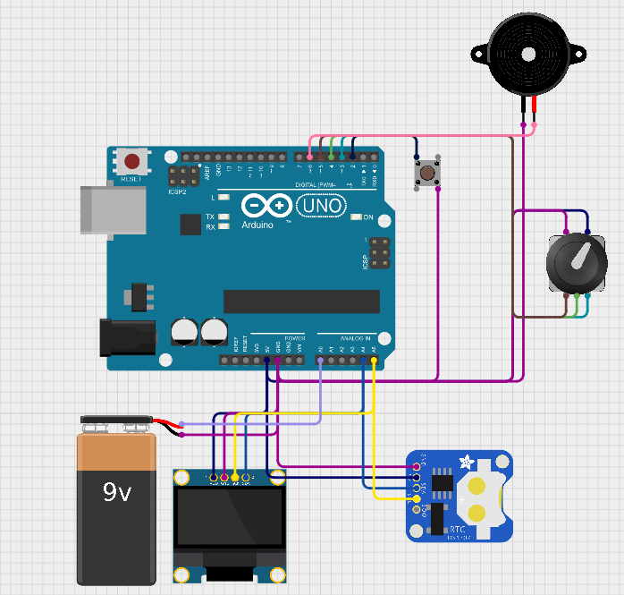

# Digital Clock

## Anggota Kelompok:

```
  1. Fachriel Yoga Wicaksono      (H1H024042)
  2. Dimas Rafif Zaidam           (H1H024043)
  3. Chaedar Ali Amrulloh	      (H1H024044)
  4. Bintang Nugraha Putra        (H1H024045)
  5. M.Fawaz Akbar                (H1H024046)
  6. Gerard Roland Kusuma Sarwoko (H1H024047)
```

---

## Deskripsi Proyek

Sistem ini merupakan **jam digital berbasis Arduino UNO** yang memiliki fitur utama:

- Menampilkan waktu real-time menggunakan modul RTC DS3231
- Tampilan jam, menit, detik, tanggal, bulan, tahun dan persentase baterai pada layar OLED SSD1306
- Pergantian mode tampilan menggunakan tombol push button
- Buzzer sebagai alarm atau notifikasi
- Alarm dapat diatur manual dengan menekan button dan
- Sinkronisasi waktu otomatis saat RTC kehilangan daya

---

## Komponen yang Digunakan

- Arduino UNO
- RTC DS3231
- OLED SSD1306 128x64 (I2C)
- Speaker Piezo
- Push Button
- Rotary Encoder
- Baterai LiPo 9V
- Kabel jumper

---

## Library yang Digunakan

```cpp
#include <RTClib.h>
#include <Adafruit_GFX.h>
#include <Adafruit_SSD1306.h>
#include <TimeLib.h>
#include <Wire.h>
#include <EEPROM.h>
```

---

## Konfigurasi Pin



| Komponen            | Pin Arduino |
| ------------------- | ----------- |
| OLED SDA            | A4          |
| OLED SCL            | A5          |
| RTC SDA             | A4          |
| RTC SCL             | A5          |
| Buzzer              | D8          |
| Tombol Mode         | D2          |
| Rotary Encoder(CLK) | D3          |
| Rotary Encoder(DT)  | D4          |
| Rotary Encoder(SW)  | D5          |
| ADC Baterai         | A0          |
| Push Button         | D2          |

> [!NOTE]
> OLED dan RTC berbagi jalur I2C yang sama (SDA & SCL), dibedakan melalui alamat I2C masing-masing.

---

## Alur Logika Sistem

### 1. Inisialisasi (Setup)

Saat sistem dinyalakan:

- Serial komunikasi dimulai pada baud rate 9600
- RTC DS3231 diinisialisasi melalui I2C
- Jika RTC kehilangan daya, waktu disetel ulang sesuai waktu kompilasi
- Mengatur pin buzzer sebagai output
- Mengatur pin button sebagai input pullup
- Mengatur interrupt
- Membaca data alarm pada memori EEPROM arduino
- OLED SSD1306 diinisialisasi pada alamat `0x3C`
- Layar diredupkan dan warna teks diset ke putih

---

### 2. Pembacaan Waktu (RTC)

RTC akan mengambil data waktu secara realtime. Ini kemudian akan digunakan untuk mengakses waktu sekarang yang kemudian ditampilkan pada OLED

---

### 3. Menampilkan Ke OLED

OLED akan menampilkan jam berdasarkan data dari RTC. Data yang ditampilkan berupa:

- Jam
- Tanggal
- Bulan
- Tahun
- Presentase baterai

Saat mengatur alarm atau menekan tombol button beberapa saat, tampilan OLED akan berubah ke tampilan Set Alarm untuk mengatur ulang alarm.

---

### 4. Set Alarm

Mengatur ulang alarm. Saat pertama masuk ke Set Alarm, anda diminta untuk mengatur nilai jamnya dengan memutar knob dari rotary encoder dan tekan button untuk mengaturnya. Setelah jam, anda diminta ngatur menitnya. Sama seperti sebelumnya, putar knob dan tekan button untuk mengesetnya. Setelah keduanya di atur, tekan lagi button untuk menyimpan alarm ke memori EEPROM.

### 5. Menunggu Output

Jika waktu saat ini sudah melewati waktu dari alarm. Buzzer akan berbunyi sebagai penanda dan akan berhenti jika buttonnya ditekan.

## Saran Peningkatan

- Baterai belum bisa digunakan karena masih memerlukan sebuah buck converter untuk menurunkan tegangan agar aman dan stabil untuk arduino.

## Dokumentasi

[Youtube](https://youtu.be/BNchCGl8Irk)
